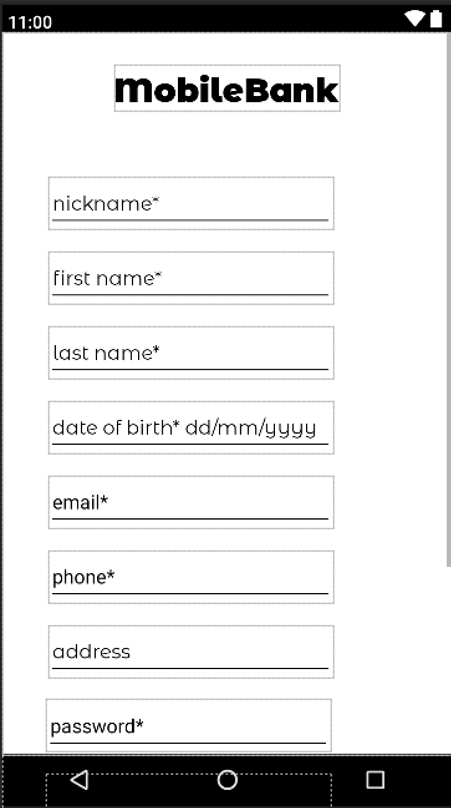
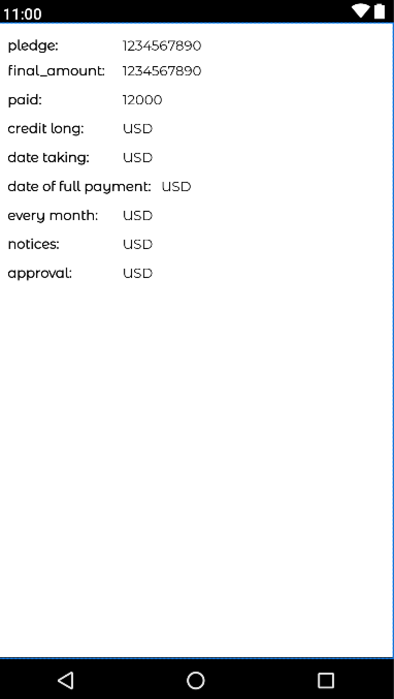

# Simple Online Banking

## Project Overview

Simple Online Banking is a comprehensive project that includes two primary components:

1. **Bank Backend**: A server-side application built using Django and Django Rest Framework (DRF).
2. **Bank Mobile App**: A client-side application built using Android Studio.

## Folder Structure

```plaintext
simple_online_banking/
├── bank_backend/
...
└── bank_mobile_app/
...
```

## Bank Backend

The backend is built with Django and Django Rest Framework (DRF). It handles all the server-side logic, database interactions, and API endpoints for the mobile app to interact with.

### Setup Instructions

1. **Navigate to the backend directory:**
   ```bash
   cd simple_online_banking/bank_backend
   ```

2. **Create and activate a virtual environment:**
   ```bash
   python3 -m venv env
   source env/bin/activate  # With DJANGO_SECRET_KEY, DJANGO_DEBUG, EMAIL_SMTP andPASS_SMTP
   ```

3. **Install the required dependencies:**
   ```bash
   pip install -r requirements.txt
   ```

4. **Apply the migrations:**
   ```bash
   python manage.py migrate
   ```

5. **Run the development server:**
   ```bash
   python manage.py runserver
   ```

## Bank Mobile App

The mobile app is built with Android Studio. It provides the user interface and interacts with the backend API.

### Setup Instructions

1. **Open Android Studio.**
2. **Open the project located in `simple_online_banking/bank_mobile_app`.**
3. **Build and run the app on an emulator or a physical device.**

## Some layouts

<table>
  <tr>
    <td></td>
    <td></td>
    <td></td>
  </tr>
  <tr>
    <td></td>
    <td></td>
    <td></td>
  </tr>
  <tr>
    <td></td>
    <td></td>
    <td></td>
  </tr>
</table>

## License

This project is licensed under the MIT License.
